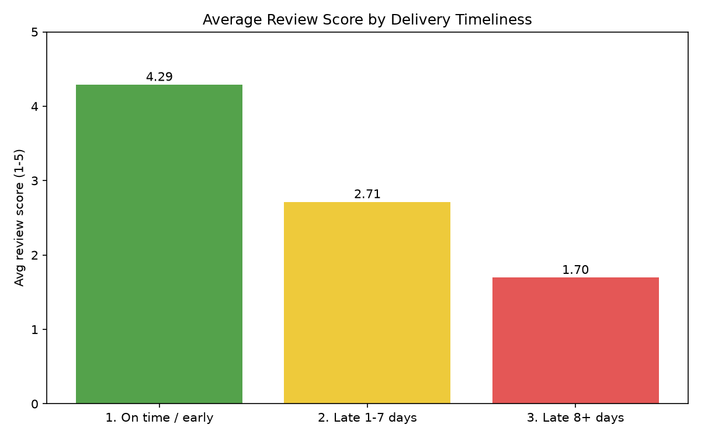
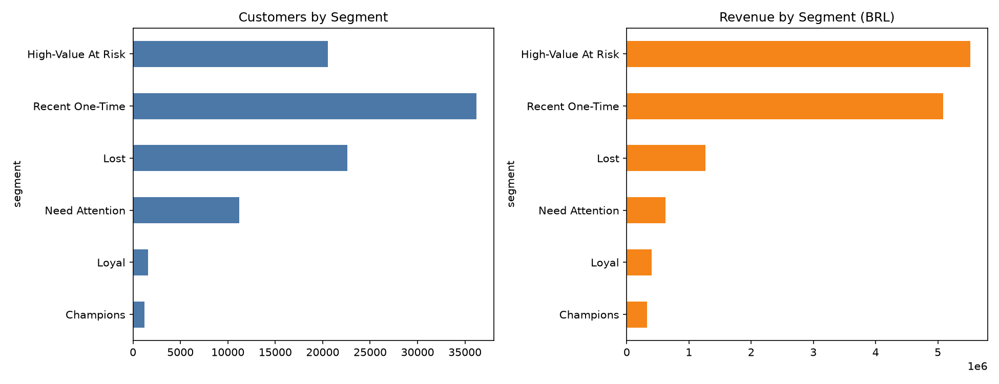
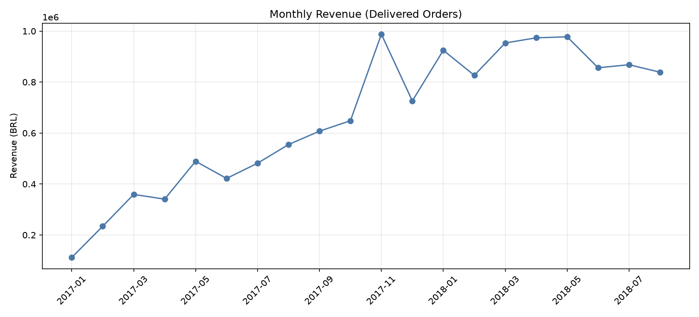
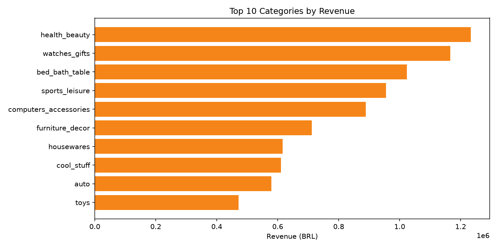
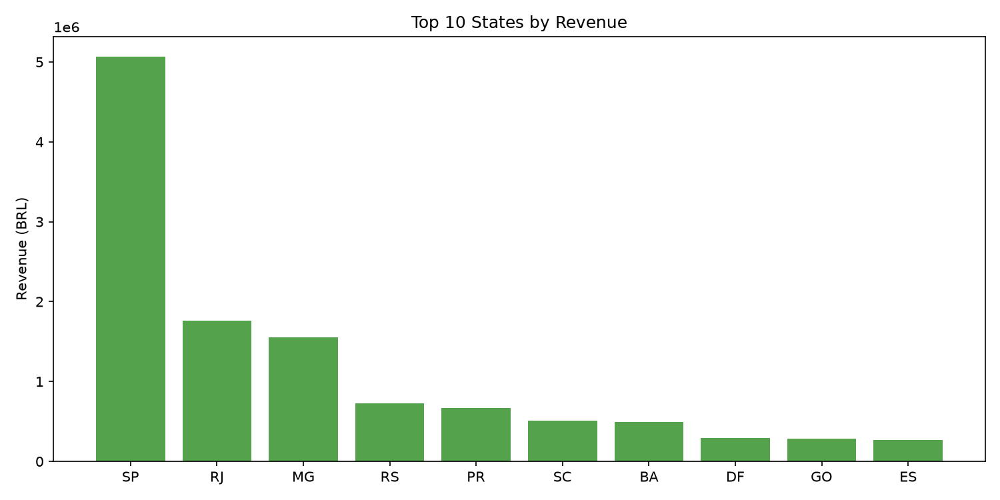

# E-Commerce Analytics: Customer Segmentation & Delivery Performance

End-to-end analysis of ~99K real orders from the Olist Brazilian marketplace, built with Python and PostgreSQL. The project cleans the raw data, loads it into a relational database, answers business questions in SQL, segments customers with RFM, and measures how late deliveries affect review scores.

## Key Findings

1. **Late deliveries sharply lower ratings.** Only 6.7% of delivered orders arrived after the estimated date, but they averaged a review score of 2.71 (1-7 days late) and 1.70 (8+ days late), compared with 4.29 for on-time orders.
2. **Retention is the biggest weakness.** Only 3.0% of customers placed a second order.
3. **A few customer groups drive most revenue.** The "High-Value At Risk" segment is 22.0% of customers but 41.8% of revenue, and these customers last purchased about 336 days before the end of the dataset.
4. **Revenue is concentrated in a few categories.** The top 10 categories bring in 62.4% of revenue. `watches_gifts` earns about 212 BRL per order versus about 110 BRL for `bed_bath_table`, so it is a low-volume, high-value category.
5. **Geography is concentrated.** Sao Paulo (SP) is the largest market by a wide margin, followed by Rio de Janeiro (RJ) and Minas Gerais (MG).
6. **Revenue grew strongly through 2017.** Monthly revenue rose from roughly 0.1M BRL in January 2017 to roughly 1.0M BRL in November 2017, then stayed between about 0.85M and 0.98M through August 2018.

### Headline numbers (delivered orders only)

| Metric | Value |
|---|---|
| Delivered orders | 96,478 |
| Unique customers | 93,358 |
| Revenue (item price, freight excluded) | 13,221,498 BRL |
| Average order value | 137.04 BRL |
| Repeat customers (2+ orders) | 3.0% |

## Dataset

[Brazilian E-Commerce Public Dataset by Olist](https://www.kaggle.com/datasets/olistbr/brazilian-ecommerce) on Kaggle: 9 CSV files covering orders, items, payments, reviews, customers, sellers, products, geolocation and category translations.

## Approach

**1. Cleaning (`src/02_clean_data.py`)**
- Converted text columns to real datetimes and created `delivery_days` and `delay_days` (actual vs estimated delivery).
- Kept orders with missing delivery dates instead of dropping them: they are cancelled or undelivered orders, not bad data.
- Kept only the latest review per order (99,224 to 98,673 rows) so joins do not duplicate orders.
- Added English category names, with the Portuguese name as fallback and `unknown` for 610 products with no category.
- Collapsed geolocation from 1,000,163 rows (261,831 exact duplicates) to one row per zip prefix (19,015 rows).

**2. Database (`src/03_load_to_postgres.py`)**: loaded the cleaned tables into PostgreSQL with SQLAlchemy and verified row counts.

**3. SQL analysis (`src/sql/01_business_queries.sql`)**: 7 queries using joins, CTEs and window functions (`LAG`, `SUM() OVER`) covering KPIs, monthly growth, category share, state revenue, payment methods, delivery delay vs reviews, and top sellers.

**4. RFM segmentation (`src/04_rfm_analysis.py`)**: Recency and Monetary scored 1-5 with quintiles. Frequency was not scored with quintiles because about 97% of customers have a single order, so "repeat or not" is used directly in the segment rules.

**5. Charts (`src/05_charts.py`)**: saved to `outputs/`.

## Delivery Timeliness vs Review Score

| Delivery | Orders | Avg review score |
|---|---|---|
| On time / early | 89,443 | 4.29 |
| Late 1-7 days | 3,600 | 2.71 |
| Late 8+ days | 2,781 | 1.70 |



## RFM Customer Segments

| Segment | Customers | % of customers | % of revenue | Avg days since last order | Avg spend (BRL) |
|---|---|---|---|---|---|
| High-Value At Risk | 20,546 | 22.0% | 41.8% | 336 | 268.8 |
| Recent One-Time | 36,224 | 38.8% | 38.4% | 91 | 140.3 |
| Lost | 22,582 | 24.2% | 9.6% | 396 | 56.0 |
| Need Attention | 11,205 | 12.0% | 4.7% | 220 | 55.6 |
| Loyal | 1,592 | 1.7% | 3.0% | 320 | 252.4 |
| Champions | 1,209 | 1.3% | 2.5% | 89 | 270.2 |

Segment rules:
- **Champions:** 2+ orders and bought recently (recency score 4-5)
- **Loyal:** 2+ orders, older last purchase
- **Recent One-Time:** single order, bought recently
- **High-Value At Risk:** single order, not recent, high spend (monetary score 4-5)
- **Lost:** single order, oldest purchases (recency score 1-2)
- **Need Attention:** everyone else



## Other Charts





## Business Recommendations (hypotheses to test)

- **Protect delivery promises.** Late orders are a small share but produce the lowest ratings. Improving delivery estimates or flagging at-risk shipments early is likely the cheapest way to lift reviews.
- **Target the High-Value At Risk segment with win-back offers.** It holds the largest share of revenue and has been inactive for a long time.
- **Follow up with Recent One-Time buyers soon after purchase.** They are the largest group and the best window to get a second order.
- **Do not spend marketing budget on the Lost segment.** Low spend and long inactivity make it the weakest return.

## Limitations

- Revenue is the sum of item prices for delivered orders and excludes freight.
- Recency is measured from the last purchase date in the dataset, not from today.
- The delivery-delay result shows an association, not proof of cause. Late orders may also have other problems.
- `delay_days` is measured in whole days, so an order less than 24 hours late falls in the "on time" bucket.
- Because ~97% of customers ordered once, cohort retention analysis would add little on this dataset.
- Win-back potential is a hypothesis: the data cannot show whether these customers would return.
- Monthly trends are shown for Jan 2017 - Aug 2018, since months outside that range are incomplete.

## Project Structure

```
ecommerce-analytics/
├── data/                    # raw CSVs (not committed, download from Kaggle)
├── outputs/                 # charts and RFM summary
├── src/
│   ├── sql/
│   │   └── 01_business_queries.sql
│   ├── load_data.py
│   ├── 02_clean_data.py
│   ├── 03_load_to_postgres.py
│   ├── 04_rfm_analysis.py
│   ├── 05_charts.py
│   └── db_config.example.py
├── requirements.txt
└── README.md
```

## How to Run

1. Clone the repo and create a virtual environment:
   ```
   git clone https://github.com/YOUR_USERNAME/ecommerce-analytics-olist.git
   cd ecommerce-analytics-olist
   python -m venv venv
   venv\Scripts\activate
   pip install -r requirements.txt
   ```
2. Download the dataset from Kaggle and put the 9 CSV files in `data/`.
3. Install PostgreSQL and create an empty database named `olist`.
4. Copy `src/db_config.example.py` to `src/db_config.py` and set your password.
5. Run the scripts from the project root, in order:
   ```
   python src/02_clean_data.py
   python src/03_load_to_postgres.py
   python src/04_rfm_analysis.py
   python src/05_charts.py
   ```
6. Run the queries in `src/sql/01_business_queries.sql` in pgAdmin or `psql`.

## Future Work

- Power BI dashboard (executive summary, customer segments, delivery performance)
- Star schema (fact and dimension tables) in PostgreSQL
- One-command pipeline that runs cleaning, loading and analysis together

## Tech Stack

Python (pandas, NumPy, Matplotlib, SQLAlchemy), PostgreSQL, SQL (CTEs, window functions), Git/GitHub
